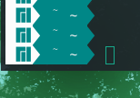
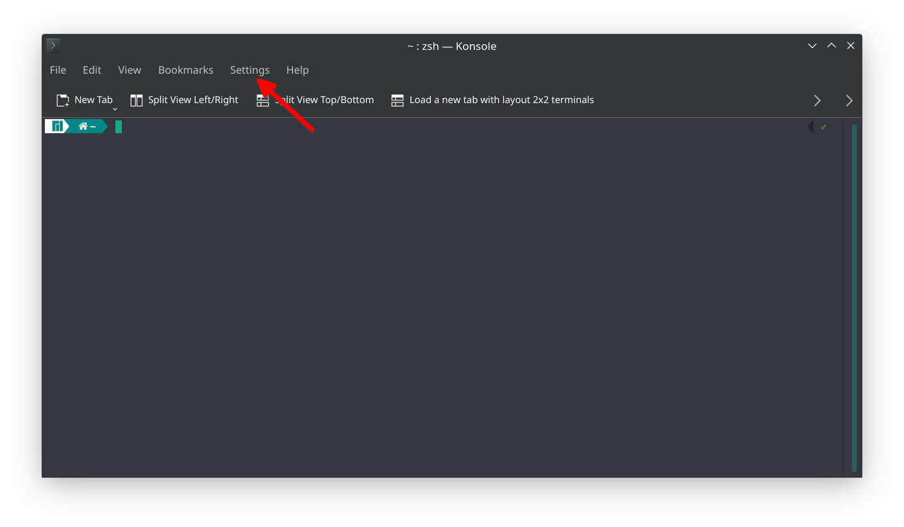
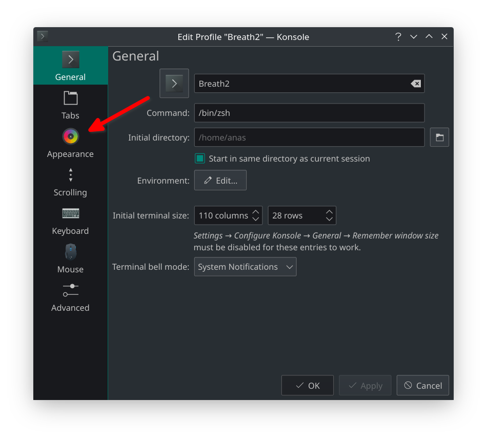
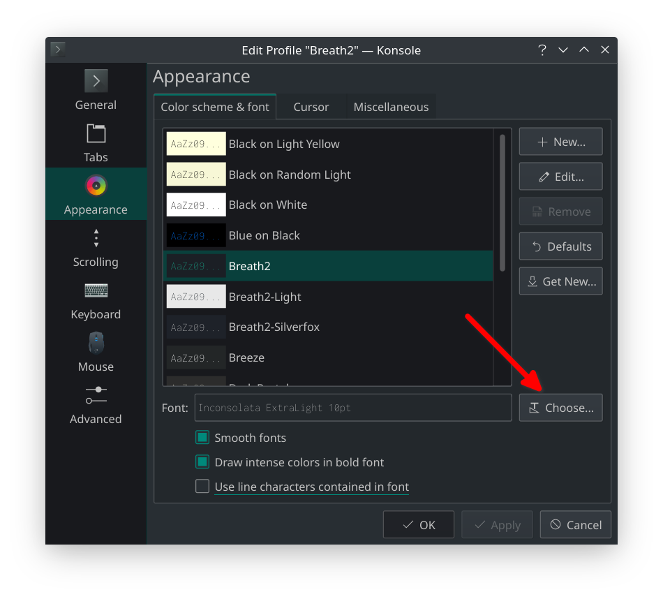
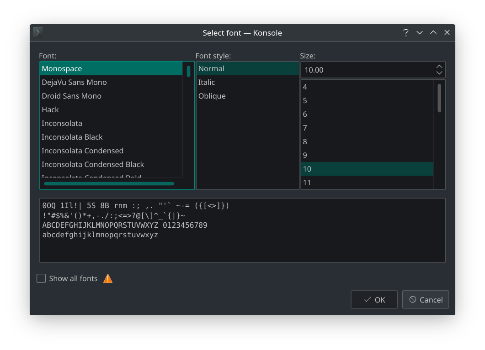
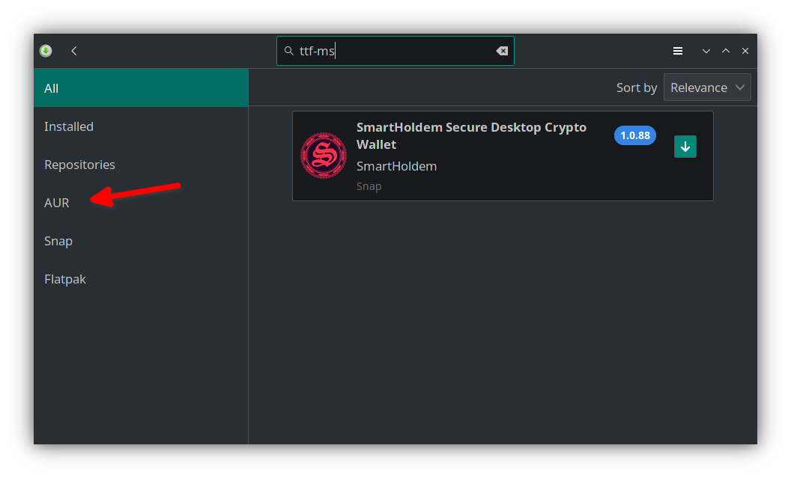

## The home icon does not appear in the terminal, what is the solution?

 

- First solution:
    1. Open your terminal
    2. Click on the settings
        
    3. Click on edit current profile
    4. Click on appearance
        
    5. Click on choose
        
    6. Choose the monospace font
        
    7. Click ok, and click ok
    7. Sign out and sign in again
- Secound solution:
    1. Open Add/Remove Software
    2. Type `ttf-ms` in the shearch bar
    3. Click on AUR
        
    4. Remove the instaled packeges and click apply
    5. Sign out and sign in again
    ---
### References:
- https://www.reddit.com/r/ManjaroLinux/comments/qse4da/the_home_icon_does_not_appear_in_the_terminal
- https://aur.archlinux.org/packages/ttf-ms-fonts
